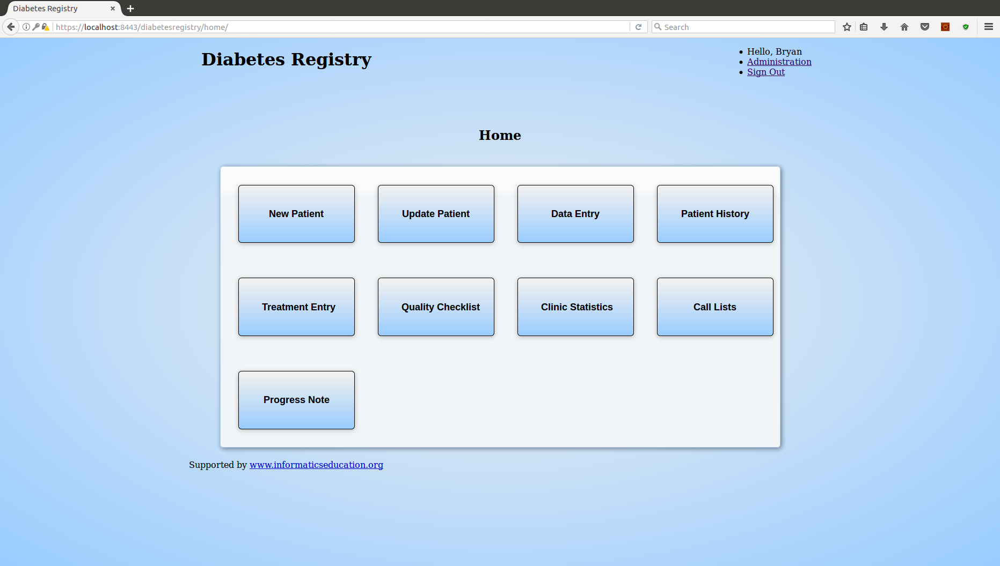
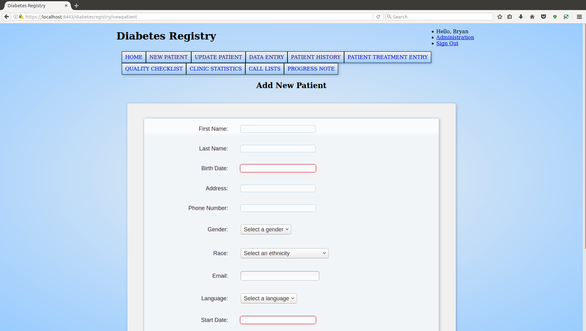
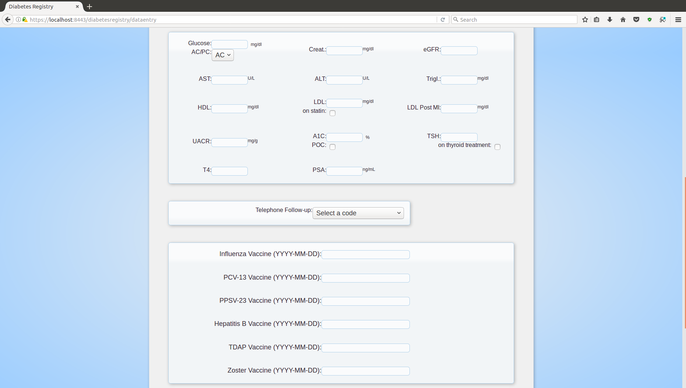
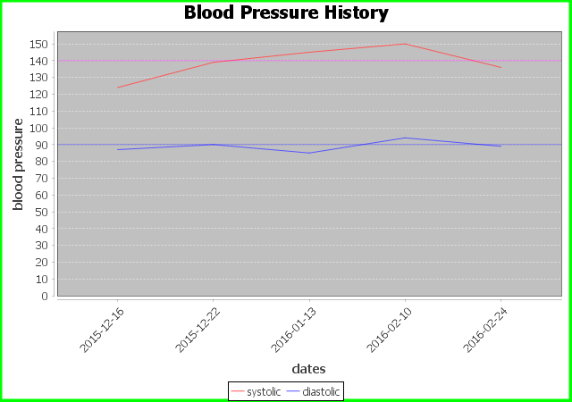

# diabetes-registry
This diabetes registry source code can be used to build a system for saving and tracking health information on patients with diabetes.

<figure>
  
  <figcaption>Figure 1. Main Menu</figcaption>
</figure>

<figure>
  
  <figcaption>Figure 2. Add Patient</figcaption>
</figure>

<figure>
  
  <figcaption>Figure 3. Data Entry</figcaption>
</figure>

<figure>
  
  <figcaption>Figure 4. Blood Pressure History</figcaption>
</figure>

## Diabetes Registry Setup and Run Instructions

## Sections

	A - requirements

	B - build MySQL database

	C - build application

	D - deploy application

	E - notes

### Section A - requirements

**a)** Download and install MySQL Community Server 5.7 and Workbench from 

http://dev.mysql.com/downloads/

**b)** Download and install JDK 8 from 

http://www.oracle.com/technetwork/java/javase/downloads/index.html

**c)** Download and install Apache Tomcat 7 from 

https://tomcat.apache.org

**d)** Download and install NetBeans 8 IDE from

https://netbeans.org/downloads/

### Section B - build MySQL database

**a)** In Workbench, open and execute the file named "createdbscript.sql" found in the db directory.

**b)** In Workbench, open and execute the file named "data_dump.sql" found in the db directory.

### Section C - build application

**a)** Place the following JAR files in the Tomcat/lib directory:

Go to 

https://jstl.java.net/download.html and download 

		- javax.servlet.jsp.jstl-api-1.2.1.jar
		
		- javax.servlet.jsp.jstl-1.2.1.jar
Go to 

https://dev.mysql.com/downloads/connector/j/ and download

		- MySQL Connector/J
		
Go to 

http://www.jfree.org/jfreechart/download.html and download

	- jcommon-1.0.23
	
	- jfreechart-1.0.19

**b)** Open the project in NetBeans to finish building the application.  Three more JAR files must be added to the project:

 - commons-lang3-3.4.jar found at https://commons.apache.org/proper/commons-lang/download_lang.cgi

 - javax.mail-1.5.1.jar found at http://mvnrepository.com/artifact/javax.mail/javax.mail-api/1.5.1

 - pdfbox-app-1.8.11.jar found at https://pdfbox.apache.org/download.cgi

Right-click on the Libraries node in the Projects view and select the 'Add JAR/Folder' option to find the downloaded JAR files and add them to the project.

**c)** Once the program compiles, build the application by selecting the 'Clean and Build Project' menu item in the 'Run' menu to produce a WAR file in the dist folder.

### Section D - deploy application

**a)** Place the WAR file in the Tomcat/webapps directory.

**b)** Run the application by executing the startup file in the Tomcat/bin directory.

**c)** View the application by pointing the browser to https://localhost:8443/diabetesregistry for a connection with SSL/TLS implemented.  Otherwise, comment out the application's security constraint in diabetesregistry/WEB-INF/web.xml and point the browser to http://localhost:8080/diabetesregistry.

**d)** Stop the application by executing the shutdown file in the Tomcat/bin directory.
	

### Section E - notes

**a)** By running the data_dump.sql file after createdbscript.sql, a default user is provided with the following credentials:

username = joeUser

password = Test1234?!

**b)** A default clinic, named "Test Clinic", is also provided by running the data_dump.sql file.

**c)** SSL/TLS:

	To utilize SSL/TLS on localhost, a self-signed certificate is required.  With a self-signed certificate created, access the running application by SSL/TLS by pointing a web browser to https://localhost:8443/diabetesregistry

	Otherwise, comment out the application's security constraint in diabetesregistry/WEB-INF/web.xml and access the running application by pointing a web browser to http://localhost:8080/diabetesregistry

**d)** storage encryption:

	A default key used for database encryption of sensitive attributes is stored in the clinic number value in configuration.xml.  The value of the default key can be modified in the configuration file before use.

